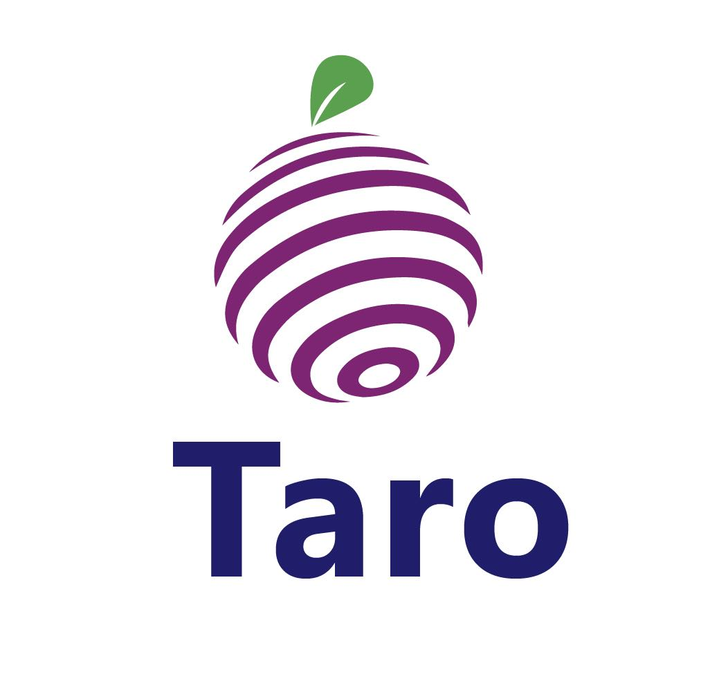

Taro is an open-source asynchronous task graph programming system using C++ Coroutine. Taro allows you to write coroutines in a task graph while abstracting away complex coroutine management. It also introduces a coroutine-aware work-stealing algorithm to support the programming model while minimizing CPU migration overhead.
See [wiki](https://github.com/dian-lun-lin/taro/wiki) for more details.
